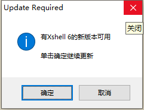

# VScode的学习和应用
## python
python的文件后缀名是.py
```py
print("hello world")
```
## markdown
markdown是当前流行的一种用来写文档的语言。
可以快捷的生成漂亮的排版和格式。
“#”代表一级标题
“##”代表二级标题
“----”代表分割线
## MySQL
## 流程图
## 图片


在vscode中推送文件到github网页上